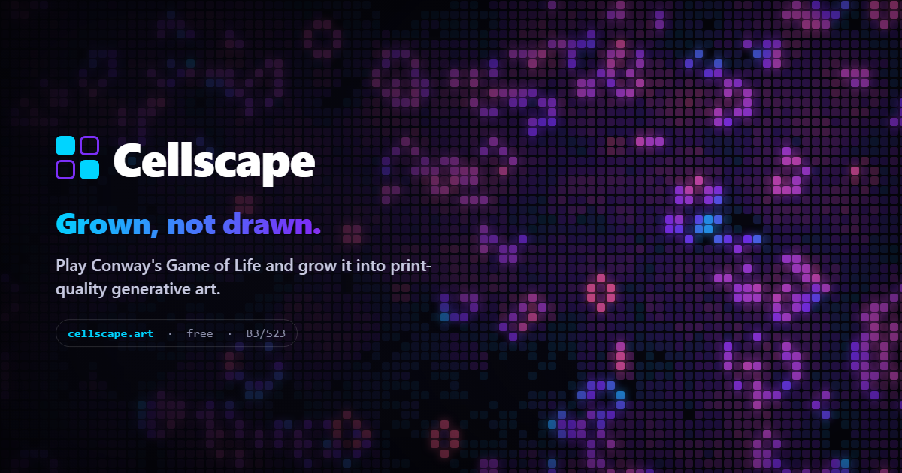

# 🦠 Cellscape — Cellular Automata Art Generator

> **Grown, not drawn.** Turn Conway's Game of Life and 30+ Life-like cellular automata into print-quality generative wall art — free, in your browser.

**→ Try it live: [cellscape.art](https://cellscape.art/)**

Web-based generative art tool: Conway's Game of Life and 30+ Life-like
cellular automata rendered as wall art — GPU-accelerated (WebGL2), 27 color
palettes, long-exposure accumulation, 3D surfaces (torus, sphere, knot,
Möbius, gravitationally-lensed black hole, exposure terrain, voxel CA),
print-quality PNG export up to 7200×10800 @300dpi, WebM video export and a
color-noise ambience generator.



**No build step.** Vanilla JS with native ES modules, Three.js lazy-loaded
from CDN via import map. Deploys as static files (Cloudflare Pages).
The WebGL2 engine boots on first interaction, so the page stays fast and
keeps the main thread free (Core Web Vitals friendly).

## Highlights

- **32 rule presets** + custom B/S rules · **26 named patterns** (glider, pulsar, Gosper glider gun, …)
- WebGL2 fragment-shader simulation, Canvas2D fallback, Raymarching-free compact GLSL
- 3D surfaces: torus, sphere, knot, Möbius, black-hole gravitational lens, terrain, voxel CA
- Export up to **7200×10800 @300dpi** (print-ready), transparent PNG, WebM video
- Deep links: `https://cellscape.art/?pattern=glider` and `?rule=seeds` preload a configuration
- Browser selftest suite (`/#selftest`) + headless CI runner

## Run locally

ES modules require HTTP (not `file://`):

```
npx http-server -p 8080
# → http://localhost:8080
```

## Structure

```
index.html            page shell (markup only) · 404.html · _headers · _redirects
styles/app.css        all styles
src/
  main.js             entry point (lazy boots engine on first interaction)
  state.js            app state + feature flags + 2D view window
  palettes.js         palettes, paper-theme derivation, gradient LUT
  rules.js            rule/pattern presets + parsing (pure)
  shaders.js          GLSL sources (sim, color, accum, bloom, reduce)
  engine-gl.js        WebGL2 engine (ping-pong RGBA32F state + accum)
  engine-cpu.js       Canvas2D fallback engine (same contract)
  engine.js           engine selection; exports the live `engine` binding
  voxel.js            3D voxel CA (pure JS)
  three3d.js          Three.js scenes: surfaces, black hole lens, terrain, voxels
  timeline.js         rewind snapshots
  ambience.js         color-noise generator (Web Audio)
  features/exports.js HD PNG + video export
  app.js              UI bindings, mode orchestration, main loop, init
blog/ gallery/ faq/ about/   static editorial pages (SEO)
test/
  selftest.js         in-browser checks (open /#selftest)
  ci-selftest.mjs     headless runner used by GitHub Actions
```

Both engines implement one contract (see `src/engine.js`); the selftest runs
the same checks against whichever engine is active.

## Tests

- Browser: open `http://localhost:8080/#selftest` — verdict in the tab title
  and console (`SELFTEST ALL-PASS`).
- Headless/CI: `npm i --no-save playwright && npx playwright install chromium`
  then `node test/ci-selftest.mjs`. Runs automatically on push via
  `.github/workflows/ci.yml`.

## License

© rcastro1089. All rights reserved. Source is visible for transparency; no
license is granted for reuse or redistribution.